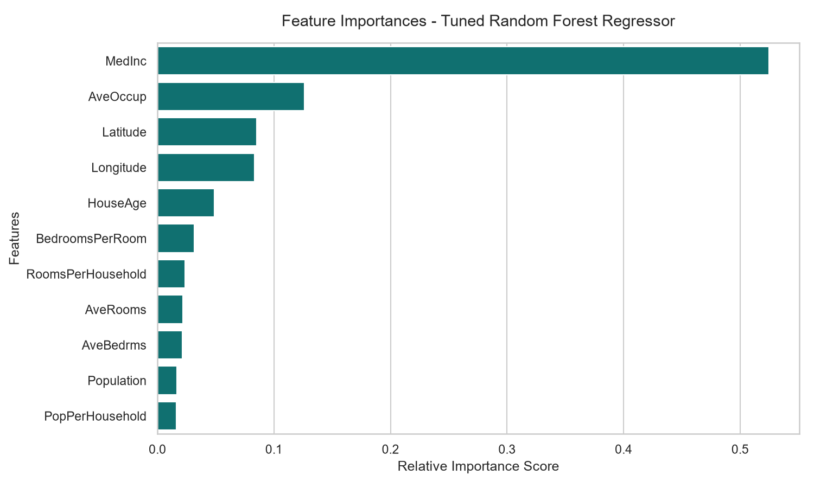
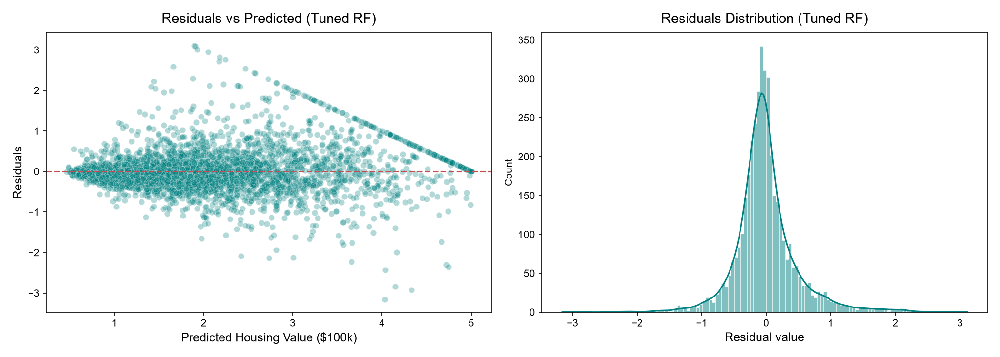

# Model Card — California Housing Price Predictor

## Model Details

*   **Developer**: Antigravity AI Assistant & Kavya
*   **Model Date**: July 2026
*   **Model Type**: Random Forest Regressor (Ensemble Regression)
*   **Preprocessing**:
    *   **Imputation**: `SimpleImputer` using `median` strategy to handle missing feature values (Data Quality Edge Case).
    *   **Scaling**: `StandardScaler` to normalize numerical continuous variables.
    *   **Pipeline wrapping**: Encapsulated in a Scikit-Learn `Pipeline` to prevent any validation data leakage.
*   **Serialization**: Serialized and exported as `best_model.pkl` for pipeline deployment.

## Intended Use

*   **Primary Application**: Predicting median house values for California block groups (census tracts).
*   **Intended Users**: Real estate market analysts, researchers, and students.
*   **Out-of-Scope Uses**: Real-time bidding or high-frequency trading in modern housing markets without adjusting for inflation and interest rate variables.

## Factors

*   **Demographic Attributes**: Median Income (`MedInc`), Population (`Population`), Average Occupancy (`AveOccup`).
*   **Property Attributes**: House Age (`HouseAge`), Average Rooms (`AveRooms`), Average Bedrooms (`AveBedrms`).
*   **Spatial Location**: Latitude (`Latitude`), Longitude (`Longitude`).
*   **Engineered Attributes**: Rooms per Household (`RoomsPerHousehold`), Bedrooms per Room (`BedroomsPerRoom`), Population per Household (`PopPerHousehold`).

## Metrics

*   **Primary Metric**: Root Mean Squared Error (RMSE) to penalize large pricing errors quadratically.
*   **Goodness-of-Fit**: Coefficient of Determination ($R^2$) to evaluate explained variance.

## Data

*   **Source**: California Housing dataset (based on 1990 U.S. Census block groups).
*   **Size**: 20,640 instances.
*   **Splitting Strategy**: 80% train, 20% hold-out test split. 5-fold cross-validation used during hyperparameter search.
*   **Data Cleaning**: Capped extreme statistical outliers (`AveRooms < 15`, `AveOccup < 6`, `AveBedrms < 3`, `Population < 10000`) to improve model stability.

## Quantitative Analyses & Performance

For exact metrics, see [metrics_table.md](file:///c:/Users/Kavya/Desktop/task-list/task-lists/week04-machine-learning/day-6/day-27/projects/ml-prediction/metrics_table.md).

### Feature Importances
The relative feature importances have been computed from the Random Forest ensemble and plotted. Median income (`MedInc`) and the engineered ratio feature `AveOccup` (average occupancy per household) are the most significant predictors.

### Diagnostic Residual Plots
A check of the residuals confirms their distribution is roughly symmetric around 0, though there is a visible prediction limit pattern around $5.0 due to the target variable cap.

## Caveats & Limitations

*   **Temporal limitations**: Data is from 1990. It does not reflect modern pricing levels, inflation, zoning changes, or current demographic profiles.
*   **Target Capping**: The target variable `MedHouseVal` was capped at $500,000 (represented as 5.0) in the original census dataset. As a result, the model cannot reliably predict home values exceeding this limit.
*   **Outlier Sensitivity**: Capping was used during training; the model may perform unpredictably on census tracts with highly extreme household sizes or room ratios.
